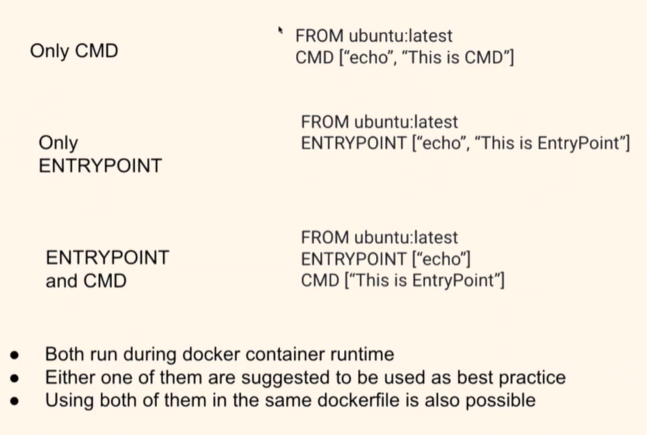
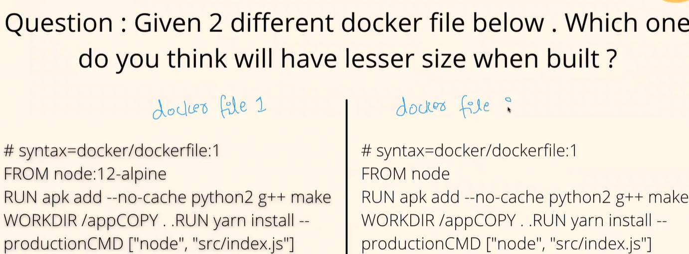

# DOCKER

## How to Check logs from my docker container & how to filter the last 200 lines from container logs.
- docker container logs [container name]
- docker container logs -tail 200 [container name]

## What will happen to container logs if you restart the container?

- If you restart the cotainer you wont lose any logs if you stop or start or restart.
- You will lose if you delete the container.
- You can use external persistence storage if you wish to keep the logs.

## If you encounter a image of size 2.7 GB is it a cause of concern?

- Bigger Docker image would result in longer build time.
- Docker image download error or API rate limiting issues
- Application will also become bulkier.

Solutions:
- Smaller Image Base (Alpine Image)
- Multi-stage build feature when building docker image.
- Remove pkg binaries after installation and dont install pkg that isnt required.
- We can lock you pkg version so that we dont install the latest pkg of that particular  pkg which might install unecessary extra dependencies.

## Docker Image vs Docker Layers:

- Docker layers are subsidary of docker image.
- Each layer within is an image itself.
- docker history image - gives the layers used in the docker image.
- Each instruction in Dockerfile is a layer.

## Explain CMD and Entrypoint in docker are both the same?

- Both CMD and ENTRYPOINT are used to run commands during the docker runtime.
- The differnce between them what kind of shell scripts or kernal they might be using. Ideally we can use both of them or any one to make sure the image is spun up properly.

## Given two docker file which will have less size.

- alpine uses the bare minimum resources to the run the linux OS.
- They are used as Light weight OS. It might not be useful in all the cases but 95% is used to build the images.