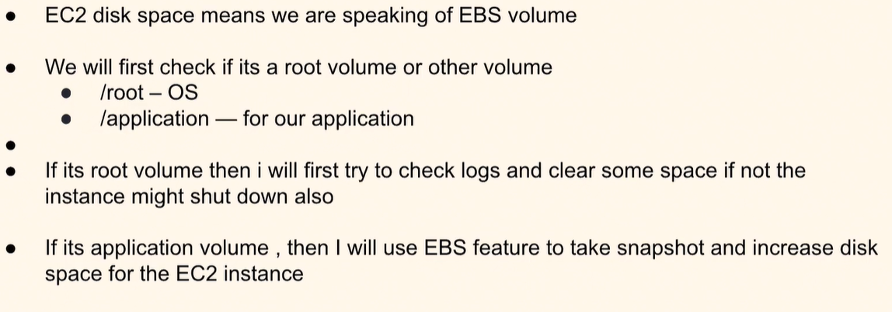
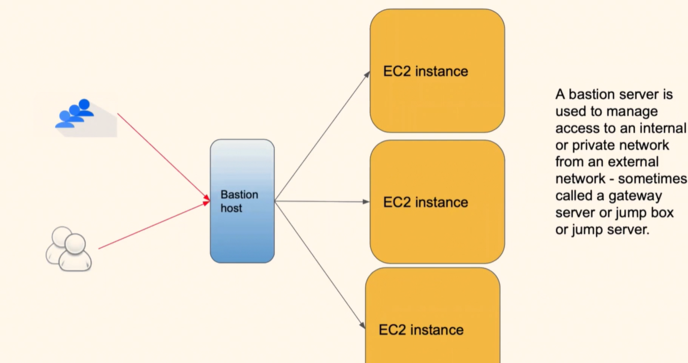
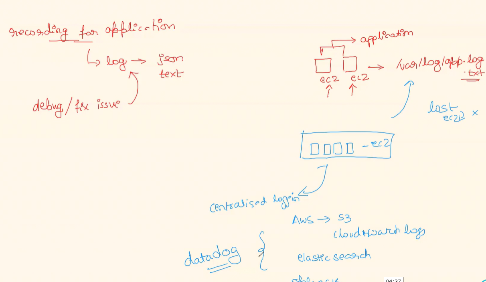

## EC2 Instance running out of Disk Space, What actions can be taken to mitigate this issue ?


- We need start checking the below steps
    1. Check if its root volume/instance store or the Mounted EBS volume(multiple can be attached).
    2. if its with the /root check the /var/logs and /tmp and other OS logs to see what is filling our root volume.
        - du -sh * | sort -rh | head -5  (top 5 folders consuming space)  
        - https://www.tecmint.com/find-top-large-directories-and-files-sizes-in-linux/
    3. if root goes to 100% instance might shut down as well.
    4. If its the application volume , then I might take a snapshot of the EBS Volume mounted and increase the disk space of the EBS Volume associated with the EC2 instance.
- Given the scenario I would start checking with which EBS volume is having the issues if its the root/ instance store EBS volume I would handle it slowly as it deals with the OS itself by checking the logs. If its related to application, I would check with the application logs and any excessive error logs, multiple jar that are not getting deployed, libs that are consuming space. I would delete these files that are not reuired after checking with the relavant parties.

## What is a bastion host or Gateway Server ? What role does they play?



- instead of Giving direct access to the VM running the applications inside a private VPC. But still admin might needs to access for debug and other issues.
- bastion Host or Jump host is like a gateway server from which different user according to their permissions can access these private VM.
- Flow how to login into these VM:
    - Login into the bastion host
    - SSH into the reuired server.
    - We can restrict user wise access to these servers
    - We can destroy this bastion host to stop the connections.
- Bastion host or gateway sever is basically a server that manages internal network or private applications. It regulates the external traffic into the internal apps via a single check point.

## Multiple EC2 Instances are being terminated in the ASG group and this is causing downtime on the application. EC2 pricing and quota all look good? How to debug this issue?


- ASG terminates the EC2 when they are in the unhealthy state.
    - Check the EC2 instance.
        - CPU (top) > process_id
        - memory consumption (free -m)  [we can suggest an new memory intensive istance ]
        - disk space utilization (du -sh *)
- Based on the information provided the ASG or the AWS doesnt have any issue these could be due to mutiple issues in the EC2 instances like CPU, memory and disk space.

## Create a Linux script that should push the certain logs to S3 automatically. All the steps required to achieve this and it should run daily on a certain time.

- Steps to be followed:
    - make sure the instance has an IAM role to write to the certain S3 bucket. or Access keys configure(not recommended practice)
    - Write a bash script
    ```sh
    #!/bin/bash
    linux files to fetch the logs files which are older than one week.
    use aws cli commands (aws s3 cp origin s3_bucket_location)
    ```
    - Schedule a cron job to run at a particular interval.

## Why logging important ? What is centralized logging and what tools helps to achieve centralized logging?


- We have mutiple instances running across mutiple env in a scalable manner. hence , we require one centralized solution to check and debug the solutions.
- Most famous ones being cloudwatch, S3, Splunk, datadog etc.,..
- These gives the chance to analyse over the period of time and take appropriate steps.

